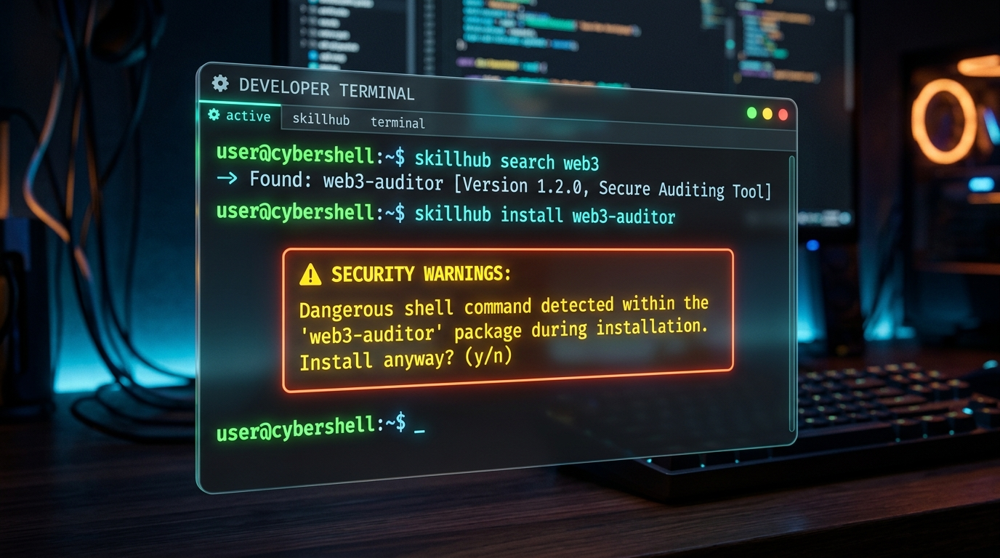

# SkillHub

[](https://www.npmjs.com/package/@harsha1029/skillhub)
[](https://opensource.org/licenses/MIT)



A universal package manager for AI Agent skills. Easily discover, install, and manage skills for Claude, Codex, Copilot, Gemini, and other autonomous agents.

## Installation

Install globally via npm:

```bash
npm install -g @harsha1029/skillhub
```

## Features

- **Centralized Registry:** Search and install community skills by name or directly via GitHub URL.
- **Built-in Security Scanner:** Automatically scans incoming skills for dangerous shell commands (e.g., `rm -rf`) and leaked secrets before installation.
- **Multi-Agent Routing:** Isolate skills locally or globally for specific agents (`claude`, `codex`, `copilot`, `gemini`).
- **State Management:** Strict lockfile architecture ensures predictable updates and dependency tracking.

## CLI Reference

### Search & Install
Search the registry for a specific capability, then install it securely.

```bash
skillhub search react
skillhub install react-scaffold

# Install directly from a repository URL
skillhub install https://github.com/user/repo/tree/main/skill-folder

# Bypass security prompts (CI/CD environments)
skillhub install react-scaffold --yes

# Route to a specific agent globally
skillhub install react-scaffold --agent gemini --global
```

### Manage Dependencies
View installed skills and update them to their latest remote commits.

```bash
# List installed skills, versions, and hashes
skillhub list

# Update all installed skills
skillhub update

# Remove a specific skill
skillhub remove react-scaffold
```

### Validation & Publishing
Validate local skill syntax and prepare for registry submission.

```bash
# Check local SKILL.md YAML frontmatter
skillhub validate ./my-skill

# Get registry submission instructions
skillhub publish ./my-skill
```

## Creating a Skill

A valid skill requires a `SKILL.md` file at its root with YAML frontmatter containing a `name` and `description`.

```markdown
---
name: my-skill
description: Comprehensive summary of the agent's capability.
---
# my-skill
Detailed instructions and context for the AI agent.
```

To publish your skill to the global registry:
1. Push your valid skill to a public GitHub repository.
2. Fork this repository.
3. Add your metadata to `registry/index.json`.
4. Submit a Pull Request.

## License

MIT License. See [LICENSE](LICENSE) for details.
